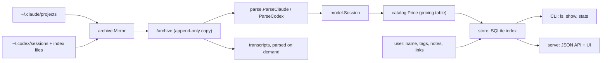

# Architecture Overview

bossman is one Go binary (`cmd/bossman`) that archives, indexes, and reports on local coding-agent sessions from Claude Code and Codex. Every command goes through a `catalog.Catalog`, which pairs the resolved configuration with an open SQLite store. The design note behind it is `docs/design.md`.

## Data flow

`Catalog.Sync` runs `Archive` and then `Index`. Parsing reads only the archive, never the agents' live files. A session therefore stays fully indexed and browsable after the agent deletes it.

## Packages

| Package | Responsibility |
| --- | --- |
| `cmd/bossman` | `main` calls `cli.Execute` and exits with its code. |
| `internal/cli` | Cobra commands: `sync`, `archive`, `index`, `scan`, `ls`, `show`, `stats`, `name`, `note`, `tag`, `link`, `meta`, `serve`, `prices`, `paths`. See [CLI Reference](../reference/cli.md). |
| `internal/catalog` | Orchestration: archive mappings, discovery, incremental indexing, cost assignment (`Price`), transcripts. |
| `internal/archive` | The append-only mirror. See [Archive and Index](archive-and-index.md). |
| `internal/parse` | Discovery and parsers for each agent's log format. See [Agent Log Formats and Parsing](../concepts/agent-logs.md). |
| `internal/model` | The agent-neutral `Session`, `Usage`, `ToolStat`, `Summary`, and transcript `Event` types. |
| `internal/pricing` | The embedded default pricing table (`default.toml`), the user override, and cost computation. See [Metrics and Cost](../concepts/metrics.md). |
| `internal/store` | The SQLite schema, the index writes, the queries (`List`, `Get`, `Stats`, `Resolve`), and the user annotations. |
| `internal/web` | `bossman serve`: the embedded static UI and the JSON API. See [Web UI and API](web-ui.md). |
| `internal/config` | The data directory, the source directories, and the idle cap. See [Configuration and Operations](../operations/configuration.md). |
| `internal/version` | The build version, set by `make build` via `-ldflags`. |

## Key types

- `model.Session` is everything derived from one session's files. Parsers produce it and `store.Put` writes it. Its key is `agent:id` (`Session.Key`). That key is the identifier everywhere: in the database, in API paths (`/api/sessions/{key}`), and as a CLI reference.
- `parse.Candidate` is a discovered session before parsing: its main log, all its files, and a size and mtime signature.
- `store.Row` and `store.Detail` are what listings and the detail view return. They join index columns with the user's annotations.
- `model.Event` is a transcript line. Transcripts are not stored: `Catalog.Transcript` reparses the archived files when asked.

## Design choices

- **Archive before analysis.** Claude Code deletes old sessions, so bossman copies the files verbatim and treats the copy as the source of truth.
- **Derived versus user data.** The index tables can be rebuilt at any time. Names, notes, tags, and links are kept in separate tables that indexing never writes.
- **Agent figures first.** When an agent records its own cost (Claude's `cost-state`), bossman reports that figure and keeps the pricing-table estimate beside it.
- **Read-only towards agents.** bossman never writes to `~/.claude` or `~/.codex`. Display names exist only in bossman.
